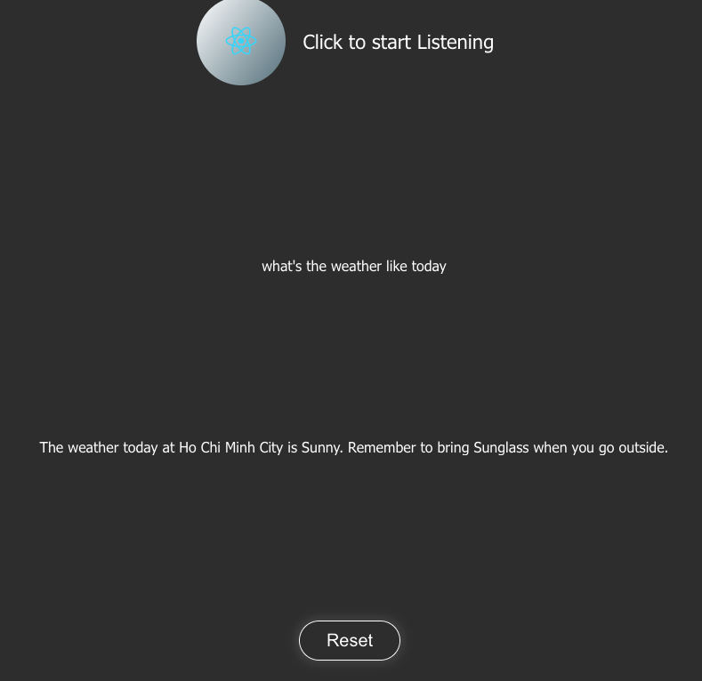

# Voice recognition app built with React

## App Screenshot



## Use guide

If you want to experience the app right now, following the below steps:

1. Clone repo

```bash
git clone /<your_github_acc>/voice_recog.git
```

2. Run the following command line to install package

```bash
npm install
```

In order to run npm, you must first make sure that you have your nodeJS installed on your machine as well as npm.

My node version is `14`, and npm is `6`

3. Run the following command line to launch app

```bash
npm start
```

This will start the app at `http://localhost:3000`, click on the big and only button to start the conversation.

**NOTE**: The chatbot is hosted on Heroku, which sleeps after a few hours of inactive. Therefore, you have experience some delays waiting for the response. (Don't worry, the response delay is just around 30 seconds, so be patient ^\_^)
